<div align="center">

# 💎 Shardfall

**A fast 3D real-time strategy game built with three.js.**
Harvest crystals with hovering *Shaper* drones, raise a crystal Citadel and lead *Lancer* knights into battle against the AI or your friends.

[](https://github.com/kajmeter/pvzlite/actions/workflows/release.yml)
[](https://github.com/kajmeter/pvzlite/releases/latest)
[](LICENSE)


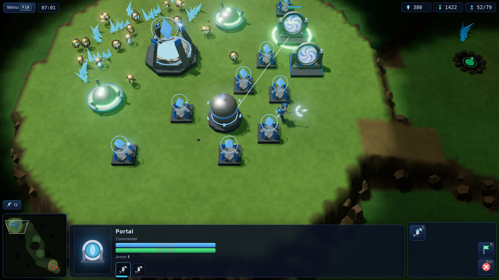

### ⬇️ [Windows installer](https://github.com/kajmeter/pvzlite/releases/latest/download/Shardfall-Setup.exe) · [Ubuntu/Debian .deb](https://github.com/kajmeter/pvzlite/releases/latest/download/shardfall_amd64.deb) · [Linux AppImage](https://github.com/kajmeter/pvzlite/releases/latest/download/Shardfall-x86_64.AppImage) · [Web build](https://github.com/kajmeter/pvzlite/releases/latest/download/shardfall-web.zip) · [All downloads](https://github.com/kajmeter/pvzlite/releases/latest)

</div>

---

## 📑 Contents

1. [Overview](#1-overview)
2. [Features](#2-features)
3. [Installation](#3-installation)
   - [3.0 Downloads at a glance](#30-downloads-at-a-glance)
   - [3.1 Windows](#31-windows)
   - [3.2 Ubuntu / Debian / Linux](#32-ubuntu--debian--linux)
   - [3.3 Web Host](#33-web-host)
   - [3.4 Dedicated multiplayer server](#34-dedicated-multiplayer-server)
   - [3.5 Docker](#35-docker)
   - [3.6 Build from source](#36-build-from-source)
4. [How to play](#4-how-to-play)
5. [Units, structures & research](#5-units-structures--research)
6. [Maps](#6-maps)
7. [Multiplayer](#7-multiplayer)
8. [Screenshots](#8-screenshots)
9. [Development](#9-development)
10. [Releases & automatic builds](#10-releases--automatic-builds)
11. [Troubleshooting](#11-troubleshooting)
12. [License & credits](#12-license--credits)

---

## 1. Overview

Shardfall is a mirror-match RTS that focuses on the core of the genre: a worker economy and shielded melee infantry. Both sides command the **Lumen Concord**:

| | |
|---|---|
| 🛸 **Shaper** | A hovering worker drone. It mines crystals and flux and *projects* structures into existence (the structure then builds itself, so the Shaper goes straight back to work). |
| ⚔️ **Lancer** | A crystal knight with a twin-bladed arc glaive. It strikes **twice per swing**. After **Lunge Drive** it moves 50% faster and dashes into enemies. |
| 🛡️ **Barriers** | Every unit and structure has a regenerating barrier that absorbs damage before hull. It recharges after 7 s out of combat. |

Games are short and intense: expand, out-produce your opponent, then trade armies over beacon towers and ramps.

<p align="center">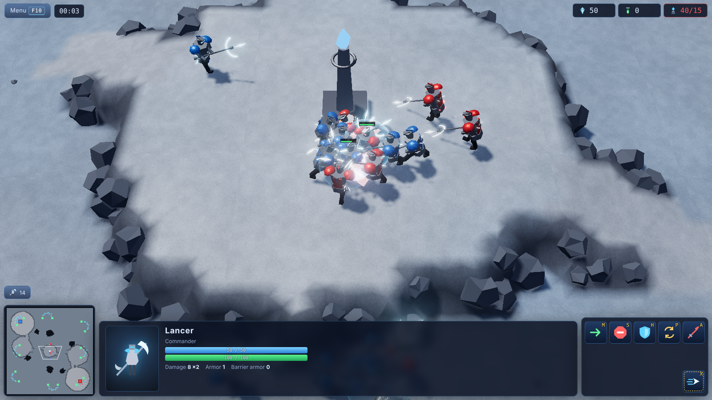</p>

## 2. Features

- 🎮 **Full RTS loop**: economy, supply, construction, production queues, tech tree, upgrades, rally points, control groups, fog of war, victory/defeat with end-game stats.
- 🧠 **Computer opponents** at four difficulties (Easy, Normal, Hard, Brutal). They scout, expand, tech, upgrade, defend and attack.
- 🌐 **Multiplayer** over LAN or Internet with lobbies, chat, teams, AI slots and a server-authoritative simulation. The server only sends what each player can see, so map hacks don't work.
- 🗺️ **5 original maps**: 1v1, 2v2 and free-for-all, each in its own biome (snow, lava, jungle, desert, orbital platform).
- ✨ **three.js graphics**: shadows, bloom, animated procedural models, glaive slashes, barrier flashes, mining beams, warp-in columns, a lava shader and fog of war shading.
- 🔊 **Procedural audio**: sound effects and ambient music are all synthesized with Web Audio. There are no asset files.
- 💻 **Runs everywhere**: in the browser, as a Windows `.exe`, as an Ubuntu/Debian `.deb`, as an AppImage, as a single-file server binary, or in Docker.
- ✅ **Tested**: unit, integration and end-to-end tests run in CI on every push, and every push publishes fresh binaries.

## 3. Installation

### 3.0 Downloads at a glance

Every push to this repository builds and publishes a new release, so these links always point to the newest build.

| Platform | File | Link |
|---|---|---|
| Windows 10/11 (installer) | `Shardfall-Setup.exe` | [Download](https://github.com/kajmeter/pvzlite/releases/latest/download/Shardfall-Setup.exe) |
| Windows (portable, no install) | `Shardfall-Portable.exe` | [Download](https://github.com/kajmeter/pvzlite/releases/latest/download/Shardfall-Portable.exe) |
| Windows (portable zip) | `Shardfall-win-x64.zip` | [Download](https://github.com/kajmeter/pvzlite/releases/latest/download/Shardfall-win-x64.zip) |
| Ubuntu / Debian / Mint / Pop!_OS | `shardfall_amd64.deb` | [Download](https://github.com/kajmeter/pvzlite/releases/latest/download/shardfall_amd64.deb) |
| Any Linux distro | `Shardfall-x86_64.AppImage` | [Download](https://github.com/kajmeter/pvzlite/releases/latest/download/Shardfall-x86_64.AppImage) |
| Web hosting (static files) | `shardfall-web.zip` | [Download](https://github.com/kajmeter/pvzlite/releases/latest/download/shardfall-web.zip) |
| Dedicated server – Linux | `shardfall-server-linux-x64` | [Download](https://github.com/kajmeter/pvzlite/releases/latest/download/shardfall-server-linux-x64) |
| Dedicated server – Windows | `shardfall-server-win-x64.exe` | [Download](https://github.com/kajmeter/pvzlite/releases/latest/download/shardfall-server-win-x64.exe) |
| Checksums | `SHA256SUMS.txt` | [Download](https://github.com/kajmeter/pvzlite/releases/latest/download/SHA256SUMS.txt) |

> **System requirements:** a 64-bit OS and any GPU with WebGL 2 (integrated graphics are fine; lower the quality in *Settings* if needed).

### 3.1 Windows

**Installer (recommended)**
1. Download [`Shardfall-Setup.exe`](https://github.com/kajmeter/pvzlite/releases/latest/download/Shardfall-Setup.exe).
2. Run it. Windows SmartScreen may say *"Windows protected your PC"* because the build is not code-signed. Click **More info → Run anyway**.
3. Choose an install folder and finish. Start **Shardfall** from the Start menu or the desktop shortcut.

**Portable (no installation)**
- Download [`Shardfall-Portable.exe`](https://github.com/kajmeter/pvzlite/releases/latest/download/Shardfall-Portable.exe) and double-click it. You can also unzip [`Shardfall-win-x64.zip`](https://github.com/kajmeter/pvzlite/releases/latest/download/Shardfall-win-x64.zip) anywhere and run `Shardfall.exe`.

**Uninstall:** *Settings → Apps → Shardfall → Uninstall*.

### 3.2 Ubuntu / Debian / Linux

**.deb package (Ubuntu, Debian, Mint, Pop!_OS, elementary…)**
```bash
wget https://github.com/kajmeter/pvzlite/releases/latest/download/shardfall_amd64.deb
sudo apt install ./shardfall_amd64.deb      # installs dependencies automatically
shardfall                                   # or launch "Shardfall" from the app menu
```
Uninstall with `sudo apt remove shardfall`.

**AppImage (Fedora, Arch, openSUSE, any distro)**
```bash
wget https://github.com/kajmeter/pvzlite/releases/latest/download/Shardfall-x86_64.AppImage
chmod +x Shardfall-x86_64.AppImage
./Shardfall-x86_64.AppImage
```
> On Ubuntu 22.04+ AppImages need FUSE 2: `sudo apt install libfuse2` (24.04+: `libfuse2t64`).

**Headless server mode:** the desktop app can also run as a dedicated server with `shardfall --server --port 7777`. For machines without a desktop, use the [server binary](#34-dedicated-multiplayer-server).

### 3.3 Web Host

Shardfall is a static web app, so any web host can serve it.

**Option A: static files (single player and AI on any host)**
1. Download [`shardfall-web.zip`](https://github.com/kajmeter/pvzlite/releases/latest/download/shardfall-web.zip) and unzip it.
2. Upload the contents of `shardfall-web/` to your host: nginx, Apache, Caddy, GitHub Pages, Netlify, Cloudflare Pages, S3, or an itch.io HTML5 upload.
3. Open the page. All paths are relative, so sub-folders like `https://example.com/games/shardfall/` work too.

Quick local test:
```bash
cd shardfall-web && python3 -m http.server 8080    # open http://localhost:8080
```

**Option B: web client and multiplayer from one process**
The [dedicated server](#34-dedicated-multiplayer-server) serves the web client and the multiplayer endpoint from a single port. Run it and share `http://YOUR_IP:7777`. Browsers that open it can play solo or join lobbies right away.

**Option C: GitHub Pages (automatic).** This repo ships a Pages workflow. Enable it once in *Settings → Pages → Source: GitHub Actions*, and every push to `main` publishes the game at `https://<user>.github.io/<repo>/`.

**nginx in front of the server (HTTPS + WebSocket)**
```nginx
server {
  listen 443 ssl;
  server_name shardfall.example.com;
  location / {
    proxy_pass http://127.0.0.1:7777;
    proxy_http_version 1.1;
    proxy_set_header Upgrade $http_upgrade;
    proxy_set_header Connection "upgrade";
    proxy_set_header Host $host;
  }
}
```
Players then connect to `wss://shardfall.example.com/ws`. The page fills this address in automatically.

### 3.4 Dedicated multiplayer server

The server binaries are **single files** with the web client embedded. They don't need Node.js or anything else.

```bash
# Linux
wget https://github.com/kajmeter/pvzlite/releases/latest/download/shardfall-server-linux-x64
chmod +x shardfall-server-linux-x64
./shardfall-server-linux-x64 --port 7777
```
```powershell
# Windows (PowerShell)
Invoke-WebRequest https://github.com/kajmeter/pvzlite/releases/latest/download/shardfall-server-win-x64.exe -OutFile shardfall-server.exe
.\shardfall-server.exe --port 7777
```

| Option | Default | Description |
|---|---|---|
| `--port <n>` | `7777` (or `$PORT`) | TCP port for HTTP and WebSocket |
| `--host <addr>` | `0.0.0.0` (or `$HOST`) | Network interface to bind |
| `--static <dir>` | embedded | Serve a different web build |
| `--no-web` | off | Multiplayer only, don't serve the web client |

Endpoints: `/` (game), `/ws` (multiplayer), `/health`, `/api/rooms`, `/api/maps`.
Open TCP port **7777** in your firewall or router for Internet play.

**Run it as a systemd service (Linux)**
```ini
# /etc/systemd/system/shardfall.service
[Unit]
Description=Shardfall game server
After=network.target

[Service]
ExecStart=/opt/shardfall/shardfall-server-linux-x64 --port 7777
Restart=always
User=nobody

[Install]
WantedBy=multi-user.target
```
```bash
sudo systemctl enable --now shardfall
```

### 3.5 Docker

```bash
docker run -d --name shardfall -p 7777:7777 --restart unless-stopped ghcr.io/kajmeter/pvzlite:latest
# or build it yourself
docker compose up -d --build
```
Then open <http://localhost:7777>.

### 3.6 Build from source

Requirements: **Node.js 20+** and Git.
```bash
git clone https://github.com/kajmeter/pvzlite.git
cd pvzlite
npm install
npm run dev            # hot-reloading dev server → http://localhost:5173
npm start              # production build + game server → http://localhost:7777
```

| Command | What it does |
|---|---|
| `npm run build` | Build the web client into `dist/` |
| `npm run server` | Run the game + multiplayer server (serves `dist/`) |
| `npm run desktop` | Run the desktop app (Electron) |
| `npm run dist:win` | Windows installer + portable exe (run on Windows) |
| `npm run dist:linux` | `.deb` + AppImage |
| `npm run dist:server` | Single-file server binaries for Linux and Windows |
| `npm run dist:web` | `release/shardfall-web.zip` |
| `npm test` | Unit and integration tests (Vitest) |
| `npm run test:e2e` | End-to-end browser tests (Playwright) |
| `npm run screenshots` | Regenerate the README screenshots |

## 4. How to play

**Goal:** destroy every enemy structure. You lose when all of yours are gone.

### 4.1 Your first minutes
1. Your 12 Shapers start mining automatically. Click the **Citadel** and press **E** to train more. Keep it busy.
2. Select a Shaper, press **B**, then **E** to place a **Conduit** before you hit supply 15/15. Conduits add +8 supply and *power* nearby structures.
3. Build a **Portal** (**B → G**) inside a Conduit's blue power field, then train **Lancers** with **Z**.
4. Build a **Siphon** (**B → A**) on a green flux vent and send three Shapers to it. Flux pays for technology.
5. Get an **Archive** (Phase Transit), a **Sanctum** (Lunge Drive) and a **Foundry** (upgrades). Take a second Citadel at a new crystal field.
6. Gather your Lancers, press **A** and click the enemy base.

### 4.2 Controls

| Input | Action |
|---|---|
| Left click / drag | Select / box select (**Shift** adds, **Ctrl**-click or double-click selects all of a type) |
| Right click | Smart command: move, attack, harvest, return cargo, follow, set rally (**Shift** queues) |
| **A** · **M** · **P** · **H** · **S** | Attack(-move) · Move · Patrol · Hold position · Stop |
| **B** then key | Shaper build menu (C Citadel, E Conduit, A Siphon, G Portal, F Foundry, Y Archive, T Sanctum, B Aegis Well) |
| **E** / **Z** | Train Shaper / Lancer (**Shift** queues 5) |
| **Z** (Phase Portal) | Warp a Lancer into any power field |
| **C** (Citadel) | Overclock a structure (+50% speed for 20 s) |
| **R** | Set rally point (rally on crystals to auto-mine) |
| **Ctrl + 1-9** / **Shift + 1-9** / **1-9** | Set / add to / recall control group (double tap centers the camera) |
| **F1** / **Ctrl+F1** / **F2** | Next idle Shaper / all idle Shapers / select army |
| **Backspace** / **Space** | Cycle Citadels / jump to the last alert |
| Arrows, screen edges, middle-drag, wheel | Pan and zoom the camera |
| **Esc** / **F10** | Cancel / game menu |
| **+** / **-** | Game speed (single player) |
| **Enter** | Chat |

### 4.3 Mechanics cheat sheet
- **Mining:** 5 crystals per trip, about 2.8 s at the field. One Shaper mines a field at a time; extra Shapers wait or bounce to a free field. 2 per field is efficient, 3 is the maximum.
- **Flux:** 4 per trip from a Siphon, 3 Shapers per Siphon.
- **Supply:** Citadel +15, Conduit +8, cap 200. Production pauses when you're supply-blocked.
- **Power:** Portal, Foundry, Archive, Sanctum and Aegis Well need a Conduit within 6.5 cells. Unpowered structures stop working.
- **Damage:** a hit drains barrier first (reduced by Barrier Lattice upgrades). Leftover damage hits hull, reduced by armor. Every hit does at least 0.5 damage.
- **Barrier regeneration:** 2.8/s after 7 s without taking damage.
- **High ground:** units can't see uphill. Hold the **Beacon Towers** (stand next to them) for wide vision.
- **Warp-in:** Phase Portals warp a Lancer in 3.6 s near a Citadel or Phase Portal, or 16 s at a distant Conduit. The portal then has a 20 s cooldown.
- **Rubble:** collapsed rubble blocks some paths on Quartz Quarry. Attack it to open the way.

## 5. Units, structures & research

### Units
| Unit | Cost | Supply | Build | Hull / Barrier | Armor | Attack | Speed | Sight |
|---|---|---|---|---|---|---|---|---|
| **Shaper** | 50 | 1 | 12 s | 20 / 20 | 0 | 5 (1.07 s) | 3.94 | 8 |
| **Lancer** | 100 | 2 | 27 s | 100 / 50 | 1 | 8 × 2 (0.86 s) | 3.15 → 4.73 with Lunge Drive | 9 |

**Lunge:** with Lunge Drive, a Lancer within 4 cells of its target dashes at 8.5 speed. Cooldown is 7 s, and the first strike deals +8 damage. It is autocast and you can toggle it with **X**.

### Structures
| Structure | Cost | Build | Hull / Barrier | Size | Needs | Purpose |
|---|---|---|---|---|---|---|
| **Citadel** | 400 | 71 s | 1000 / 1000 | 5×5 | – | Trains Shapers, resource drop-off, +15 supply, Overclock |
| **Conduit** | 100 | 18 s | 200 / 200 | 2×2 | – | +8 supply, power field |
| **Siphon** | 75 | 21 s | 300 / 300 | 3×3 | flux vent | Flux harvesting |
| **Portal** | 150 | 46 s | 500 / 500 | 3×3 | Citadel, power | Trains Lancers / becomes Phase Portal |
| **Foundry** | 150 | 32 s | 400 / 400 | 3×3 | Citadel, power | Weapon, armor and barrier upgrades |
| **Archive** | 150 | 36 s | 550 / 550 | 3×3 | Portal, power | Phase Transit; unlocks Sanctum and Aegis Well |
| **Sanctum** | 150 / 100 flux | 36 s | 500 / 500 | 3×3 | Archive, power | Lunge Drive; unlocks level 2-3 upgrades |
| **Aegis Well** | 100 | 29 s | 150 / 150 | 2×2 | Archive, power | Restores barriers of nearby allies (energy) |

### Research
| Research | Where | Cost (crystals/flux) | Time | Effect |
|---|---|---|---|---|
| Phase Transit | Archive | 50/50 | 100 s | Portals become Phase Portals (warp-in) |
| Lunge Drive | Sanctum | 100/100 | 100 s | Lancer speed +50% and dash |
| Arc Weapons 1-3 | Foundry | 100/100 · 150/150 · 200/200 | 129-179 s | +1 Lancer damage per strike per level |
| Plating 1-3 | Foundry | 100/100 · 150/150 · 200/200 | 129-179 s | +1 unit armor per level |
| Barrier Lattice 1-3 | Foundry | 150/150 · 225/225 · 300/300 | 129-179 s | +1 barrier armor per level (units and structures) |

## 6. Maps

| | Map | Players | Size | Theme |
|---|---|---|---|---|
| 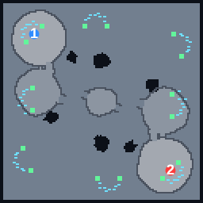 | **Frostgate Ruins** | 2 | 128×128 | Frozen highland fortresses: high-ground main, mid-ground natural, central beacon hill |
| 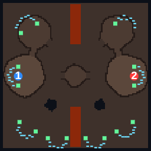 | **Ember Crossing** | 2 | 112×112 | A molten rift splits the map. Fight over the passages and the beacon plateau |
| 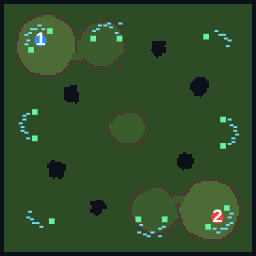 | **Verdant Hollow** | 2 | 136×136 | Jungle temple terraces with many expansions, two flanking beacons and rich crystal fields |
| 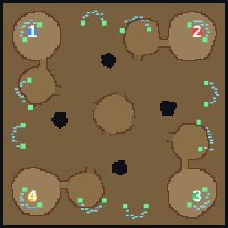 | **Quartz Quarry** | 4 | 152×152 | Four sandstone fortresses with naturals, rubble-blocked paths and a central beacon |
| 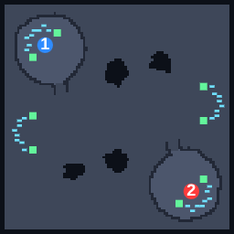 | **Proving Grounds** | 2 | 96×96 | A compact orbital platform for quick games |

## 7. Multiplayer

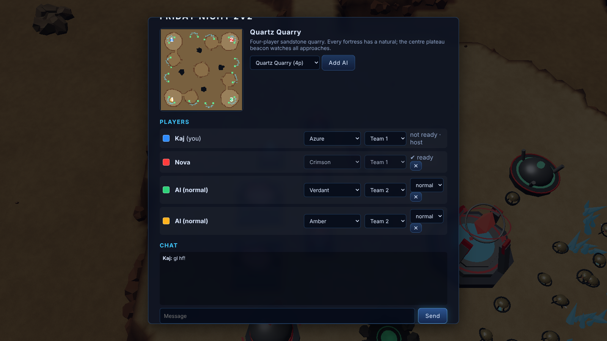

**Host from the desktop app (LAN):** *Multiplayer → Host LAN server on port 7777*. The app shows your LAN address (e.g. `ws://192.168.1.20:7777`). Friends enter it under *Server address* and connect.

**Host a dedicated server:** run the [server binary](#34-dedicated-multiplayer-server) or [Docker image](#35-docker). People can open `http://SERVER_IP:7777` in a browser and play right away, or connect from the desktop app.

**In the lobby:** create a game, pick a map, add AI players, set teams and colors, chat. The host starts the game once everyone is ready. Leaving a running game counts as surrendering.

The server runs the simulation at 20 ticks/s, validates every command, and streams 10 Hz snapshots filtered by each player's fog of war. Clients interpolate between snapshots.

## 8. Screenshots

| | |
|---|---|
| 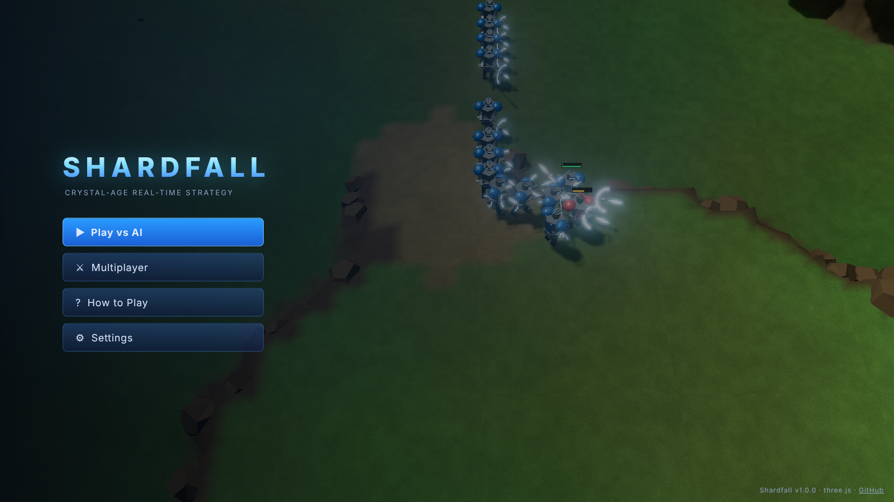 Main menu with a live AI battle behind it | 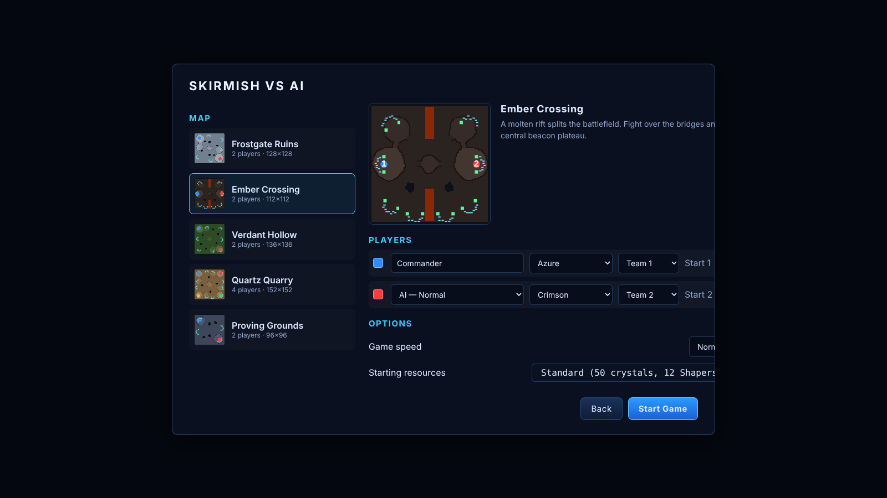 Skirmish setup: maps, AI difficulty, teams |
| 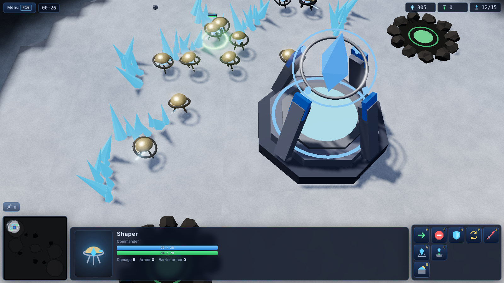 Shapers harvesting crystals | 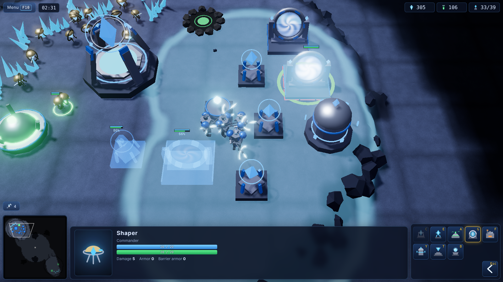 Placing a Portal inside a Conduit's power field |
| 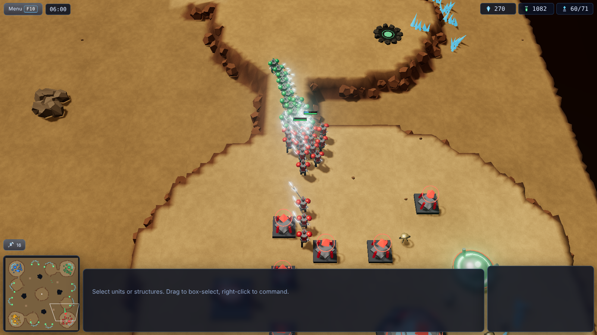 2v2 on Quartz Quarry | 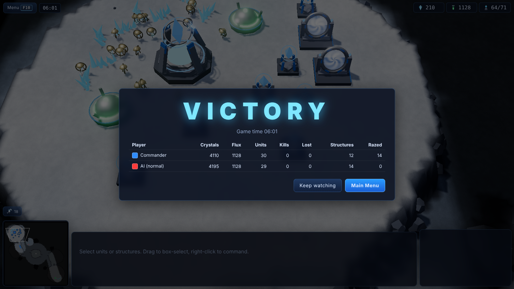 Victory screen with match statistics |
| 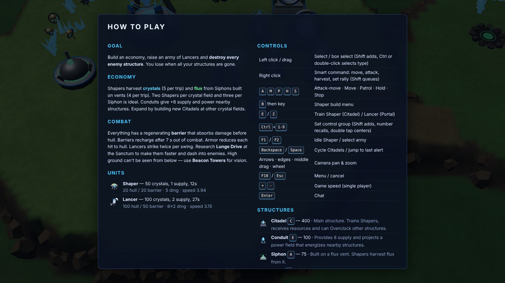 Built-in *How to Play* |  Lancers clash at a beacon |

## 9. Development

```
pvzlite/
├─ src/shared/          # deterministic simulation shared by client + server
│  ├─ data/defs.js      #   unit, structure and research data
│  ├─ maps/             #   map generator + 5 map descriptions
│  ├─ sim/              #   world, pathfinding (A*), movement, combat, economy, vision
│  ├─ ai/ai.js          #   computer opponent (4 difficulties)
│  └─ net/protocol.js   #   snapshot protocol (fog-filtered)
├─ src/client/          # three.js client
│  ├─ render/           #   terrain, instanced unit rigs, structures, effects, fog shader
│  ├─ ui/               #   HUD, minimap, menus, icons
│  ├─ input/            #   RTS camera + controls
│  ├─ game/             #   local session, command card, game loop
│  ├─ net/              #   WebSocket client + remote session
│  └─ audio/            #   procedural Web Audio
├─ server/              # Node.js HTTP + WebSocket server (lobbies, rooms)
├─ desktop/             # Electron shell (Windows/Linux apps)
├─ scripts/             # icons, server binaries (Node SEA), web zip, screenshots
├─ tests/               # Vitest: simulation, maps, server
├─ e2e/                 # Playwright: menus, gameplay, multiplayer
└─ .github/workflows/   # CI, release-on-every-push, GitHub Pages
```

- **One simulation, everywhere:** the same `World` runs in the browser for single player and on the server for multiplayer. It is deterministic for a given seed, which the tests check.
- **Rendering:** units are instanced rigs (one `InstancedMesh` per body part) animated procedurally, so hundreds of units cost about a dozen draw calls. Fog of war is a data texture sampled in every material's shader.
- **Tests:** `npm test` runs 50+ unit and integration tests (combat math, mining, production, research, abilities, pathfinding, map validity, AI, determinism, lobby and snapshot protocol). `npm run test:e2e` plays the game in Chromium.
- **Debug API:** in the browser console, `__shardfall.debug` can `autoplay()`, `run(ticks)`, `spawn()`, `reveal()` and more.

## 10. Releases & automatic builds

The [`Build & Release`](.github/workflows/release.yml) workflow runs on **every push**:

1. Unit, integration and end-to-end tests.
2. Linux: `.deb`, AppImage, Windows zip, server binaries (Linux and Windows), web zip.
3. Windows: NSIS installer and portable `.exe`.
4. Publishes a GitHub Release `v1.0.<build>` marked **latest**, with stable file names, so the [download links](#30-downloads-at-a-glance) always point to the newest build.
5. Pushes the Docker image `ghcr.io/kajmeter/pvzlite:latest`.

## 11. Troubleshooting

| Problem | Fix |
|---|---|
| Black screen or low FPS | *Settings → Quality → Low/Medium*. Make sure hardware acceleration is enabled in your browser. |
| "Windows protected your PC" | The build isn't code-signed. Click **More info → Run anyway**. |
| AppImage won't start | `sudo apt install libfuse2` (or `libfuse2t64`) and `chmod +x` the file. |
| Can't connect to a server | Check the address (`ws://IP:7777/ws`), the firewall or port forwarding for TCP 7777, and use `wss://` when the page is served over HTTPS. |
| No sound | Click once inside the game window. Browsers only start audio after user interaction. |

## 12. License & credits

Code is released under the [Apache License 2.0](LICENSE).

Shardfall is an **original** game: all units, structures, names, maps, 3D models, icons, sounds and music were created procedurally for this project. It is inspired by the mechanics of classic real-time strategy games (worker economies, regenerating shields, melee charges), but it is not affiliated with, endorsed by, or using assets from any commercial RTS or its publisher.

Built with [three.js](https://threejs.org), [ws](https://github.com/websockets/ws), [Vite](https://vitejs.dev), [Electron](https://www.electronjs.org), [Vitest](https://vitest.dev) and [Playwright](https://playwright.dev).
