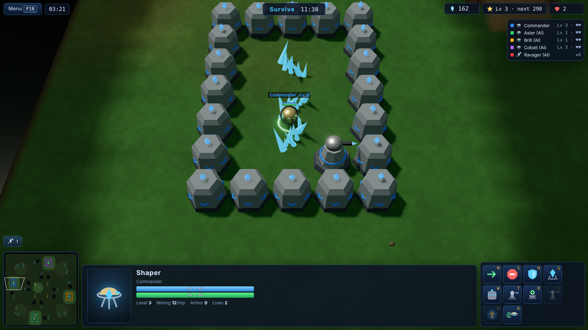
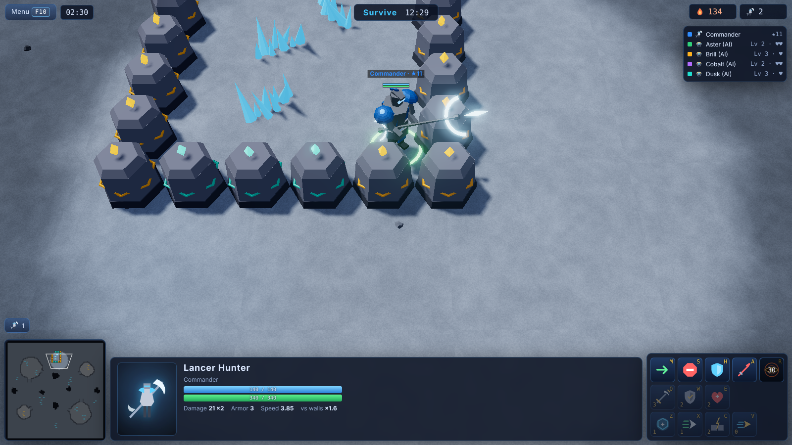
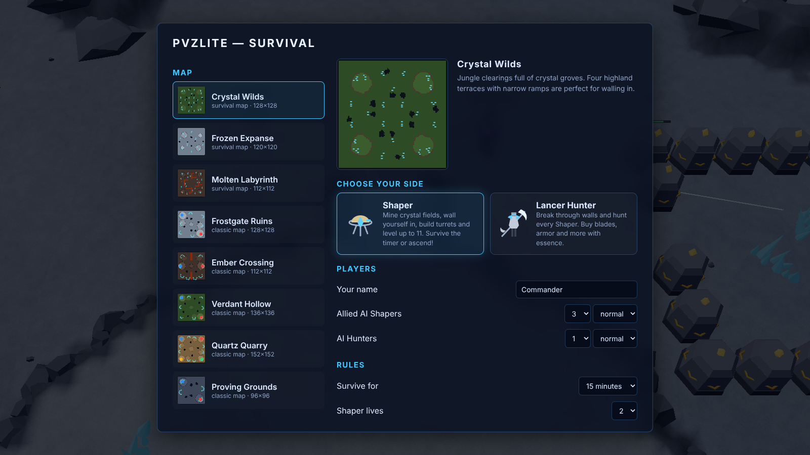
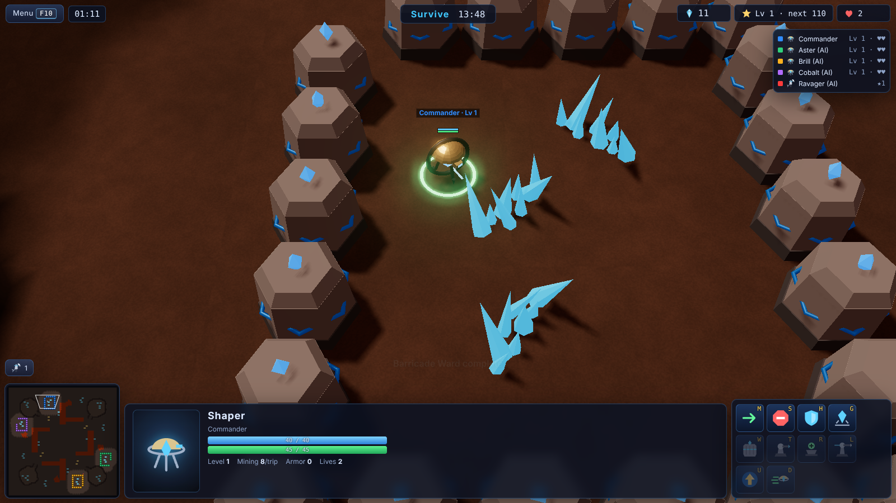
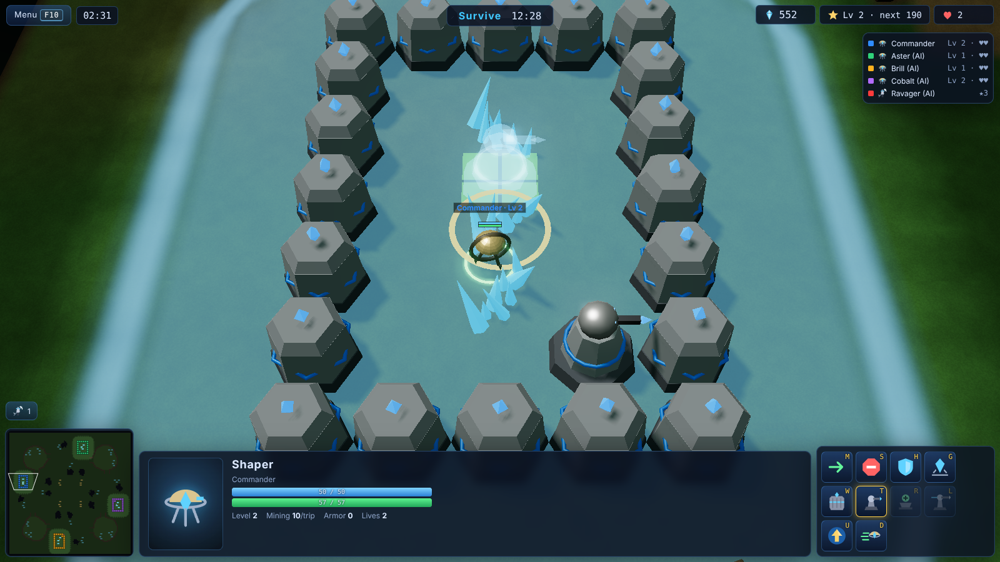
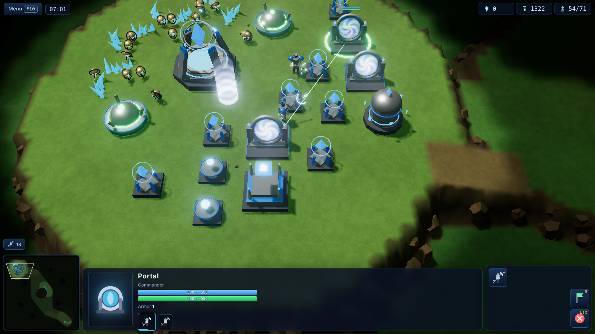
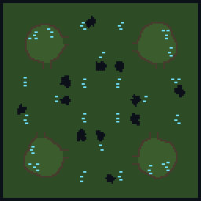
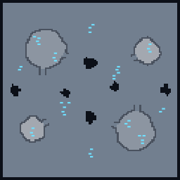
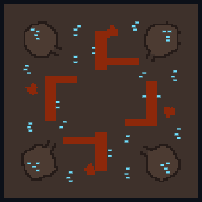
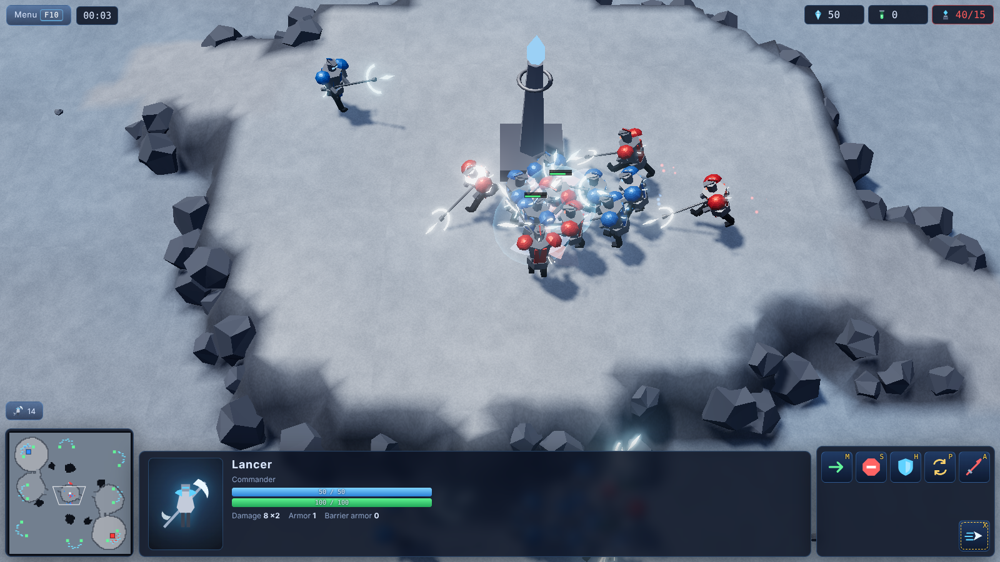

<div align="center">

# 💎 pvzlite

**Shapers vs Lancers: a 3D survival RTS built with three.js.**
Run to a crystal field, wall yourself in, build turrets and level up to 11, or play the Hunter: upgrade your blades and armor and smash every fortress open.

[](https://github.com/kajmeter/pvzlite/actions/workflows/release.yml)
[](https://github.com/kajmeter/pvzlite/releases/latest)
[](LICENSE)




### ⬇️ [Windows installer](https://github.com/kajmeter/pvzlite/releases/latest/download/pvzlite-Setup.exe) · [Ubuntu/Debian .deb](https://github.com/kajmeter/pvzlite/releases/latest/download/pvzlite_amd64.deb) · [Linux AppImage](https://github.com/kajmeter/pvzlite/releases/latest/download/pvzlite-x86_64.AppImage) · [Web build](https://github.com/kajmeter/pvzlite/releases/latest/download/pvzlite-web.zip) · [All downloads](https://github.com/kajmeter/pvzlite/releases/latest)

<table>
<tr>
<td></td>
<td></td>
</tr>
<tr>
<td align="center"><sub>Hunter breaking a wall</sub></td>
<td align="center"><sub>Main menu (live AI match in the background)</sub></td>
</tr>
</table>

</div>

---

## 📑 Contents

1. [Overview](#1-overview)
2. [Features](#2-features)
3. [Installation](#3-installation)
   - [3.0 Downloads at a glance](#30-downloads-at-a-glance)
   - [3.1 Windows](#31-windows)
   - [3.2 Ubuntu / Debian / Linux](#32-ubuntu--debian--linux)
   - [3.3 Web Host](#33-web-host)
   - [3.4 Dedicated multiplayer server](#34-dedicated-multiplayer-server)
   - [3.5 Docker](#35-docker)
   - [3.6 Build from source](#36-build-from-source)
4. [How to play](#4-how-to-play)
   - [4.1 Playing a Shaper](#41-playing-a-shaper)
   - [4.2 Playing a Hunter](#42-playing-a-hunter)
   - [4.3 Controls](#43-controls)
   - [4.4 Classic RTS mode](#44-classic-rts-mode)
5. [Stats & numbers](#5-stats--numbers)
6. [Maps](#6-maps)
7. [Multiplayer](#7-multiplayer)
8. [Screenshots](#8-screenshots)
9. [Development](#9-development)
10. [Releases & automatic builds](#10-releases--automatic-builds)
11. [Troubleshooting](#11-troubleshooting)
12. [License & credits](#12-license--credits)

---

## 1. Overview

pvzlite is an asymmetric **survival** game in the spirit of the classic "probes vs zealots" custom maps:

| | |
|---|---|
| 🛸 **Shapers** (builders) | Hover drones spread across the map. Race to a crystal field, mine it, **wall yourself in** with Barricade Wards, place **turrets** and **level up**. Reach **level 11** or survive until the timer runs out and the Shapers win. |
| ⚔️ **Lancer Hunters** | Glaive knights locked in a cage in the middle of the map for the first **60 seconds**. Once released, they earn **essence** over time and for every kill, and spend it on **blades, armor, vitality, barrier, speed, sunder and lunge** upgrades. Hunt down every Shaper to win. |

Each Shaper has **2 lives**. Hunters respawn when they fall. The longer the game runs, the stronger both sides get: Shapers out-level the Hunters, or the Hunters out-upgrade the walls.

A full **Classic RTS** mode (economy, tech tree, armies, 1v1/2v2/FFA) is also included.

## 2. Features

- 🏰 **Survival mode**: 1-8 Shapers vs 1-2 Hunters, hunter cage and release timer, crystal groves, walls with power fields, turrets, mending wells, lance turrets, 11 builder levels, 7 hunter upgrade tracks, reveal pulse, sprint, lives and respawns.
- 🧠 **Computer players for both roles** at four difficulties (Easy, Normal, Hard, Brutal). AI Shapers pick a safe grove, plan and seal a wall ring, add defenses and level up. AI Hunters buy upgrades, scout with reveal, path *through* the weakest wall and retreat when hurt.
- 🌐 **Multiplayer** over LAN or Internet: lobbies, chat, roles, AI slots and a server-authoritative simulation. The server only sends what each player can see, so map hacks don't work.
- 🗺️ **8 original maps**: 3 survival maps (jungle, snow, lava) and 5 classic RTS maps.
- ✨ **three.js graphics**: shadows, bloom, animated procedural models, glaive slashes, turret bolts, barrier flashes, mining beams, power fields, a lava shader and fog of war.
- 🔊 **Procedural audio**: every sound and the music are synthesized with Web Audio. There are no asset files.
- 💻 **Runs everywhere**: in the browser, as a Windows `.exe`, as an Ubuntu/Debian `.deb`, as an AppImage, as a single-file server binary, or in Docker.
- ✅ **Tested**: unit, integration and end-to-end tests run in CI on every push, and every push publishes fresh binaries.

## 3. Installation

### 3.0 Downloads at a glance

Every push to this repository builds and publishes a new release, so these links always point to the newest build.

| Platform | File | Link |
|---|---|---|
| Windows 10/11 (installer) | `pvzlite-Setup.exe` | [Download](https://github.com/kajmeter/pvzlite/releases/latest/download/pvzlite-Setup.exe) |
| Windows (portable, no install) | `pvzlite-Portable.exe` | [Download](https://github.com/kajmeter/pvzlite/releases/latest/download/pvzlite-Portable.exe) |
| Windows (portable zip) | `pvzlite-win-x64.zip` | [Download](https://github.com/kajmeter/pvzlite/releases/latest/download/pvzlite-win-x64.zip) |
| Ubuntu / Debian / Mint / Pop!_OS | `pvzlite_amd64.deb` | [Download](https://github.com/kajmeter/pvzlite/releases/latest/download/pvzlite_amd64.deb) |
| Any Linux distro | `pvzlite-x86_64.AppImage` | [Download](https://github.com/kajmeter/pvzlite/releases/latest/download/pvzlite-x86_64.AppImage) |
| Web hosting (static files) | `pvzlite-web.zip` | [Download](https://github.com/kajmeter/pvzlite/releases/latest/download/pvzlite-web.zip) |
| Dedicated server – Linux | `pvzlite-server-linux-x64` | [Download](https://github.com/kajmeter/pvzlite/releases/latest/download/pvzlite-server-linux-x64) |
| Dedicated server – Windows | `pvzlite-server-win-x64.exe` | [Download](https://github.com/kajmeter/pvzlite/releases/latest/download/pvzlite-server-win-x64.exe) |
| Checksums | `SHA256SUMS.txt` | [Download](https://github.com/kajmeter/pvzlite/releases/latest/download/SHA256SUMS.txt) |

> **System requirements:** a 64-bit OS and any GPU with WebGL 2. Integrated graphics are fine; lower the quality in *Settings* if needed.

### 3.1 Windows

**Installer (recommended)**
1. Download [`pvzlite-Setup.exe`](https://github.com/kajmeter/pvzlite/releases/latest/download/pvzlite-Setup.exe).
2. Run it. Windows SmartScreen may say *"Windows protected your PC"* because the build is not code-signed. Click **More info → Run anyway**.
3. Choose an install folder and finish. Start **pvzlite** from the Start menu or the desktop shortcut.

**Portable (no installation)**
- Download [`pvzlite-Portable.exe`](https://github.com/kajmeter/pvzlite/releases/latest/download/pvzlite-Portable.exe) and double-click it, or unzip [`pvzlite-win-x64.zip`](https://github.com/kajmeter/pvzlite/releases/latest/download/pvzlite-win-x64.zip) anywhere and run `pvzlite.exe`.

**Uninstall:** *Settings → Apps → pvzlite → Uninstall*.

### 3.2 Ubuntu / Debian / Linux

**.deb package (Ubuntu, Debian, Mint, Pop!_OS, elementary…)**
```bash
wget https://github.com/kajmeter/pvzlite/releases/latest/download/pvzlite_amd64.deb
sudo apt install ./pvzlite_amd64.deb      # installs dependencies automatically
pvzlite                                   # or launch "pvzlite" from the app menu
```
Uninstall with `sudo apt remove pvzlite`.

**AppImage (Fedora, Arch, openSUSE, any distro)**
```bash
wget https://github.com/kajmeter/pvzlite/releases/latest/download/pvzlite-x86_64.AppImage
chmod +x pvzlite-x86_64.AppImage
./pvzlite-x86_64.AppImage
```
> On Ubuntu 22.04+ AppImages need FUSE 2: `sudo apt install libfuse2` (24.04+: `libfuse2t64`).

**Headless server mode:** the desktop app can also run as a dedicated server with `pvzlite --server --port 7777`. For machines without a desktop, use the [server binary](#34-dedicated-multiplayer-server).

### 3.3 Web Host

pvzlite is a static web app, so any web host can serve it.

**Option A: static files (single player vs AI on any host)**
1. Download [`pvzlite-web.zip`](https://github.com/kajmeter/pvzlite/releases/latest/download/pvzlite-web.zip) and unzip it.
2. Upload the contents of `pvzlite-web/` to your host: nginx, Apache, Caddy, GitHub Pages, Netlify, Cloudflare Pages, S3, or an itch.io HTML5 upload.
3. Open the page. All paths are relative, so sub-folders like `https://example.com/games/pvzlite/` work too.

Quick local test:
```bash
cd pvzlite-web && python3 -m http.server 8080    # open http://localhost:8080
```

**Option B: web client and multiplayer from one process**
The [dedicated server](#34-dedicated-multiplayer-server) serves the web client and the multiplayer endpoint on a single port. Run it and share `http://YOUR_IP:7777`. Anyone who opens it can play solo or join lobbies right away.

**Option C: GitHub Pages (automatic).** This repo ships a Pages workflow. Enable it once in *Settings → Pages → Source: GitHub Actions*; every push to `main` then publishes the game at `https://<user>.github.io/<repo>/`.

**nginx in front of the server (HTTPS + WebSocket)**
```nginx
server {
  listen 443 ssl;
  server_name pvzlite.example.com;
  location / {
    proxy_pass http://127.0.0.1:7777;
    proxy_http_version 1.1;
    proxy_set_header Upgrade $http_upgrade;
    proxy_set_header Connection "upgrade";
    proxy_set_header Host $host;
  }
}
```
Players then connect to `wss://pvzlite.example.com/ws`. The page fills this address in automatically.

### 3.4 Dedicated multiplayer server

The server binaries are **single files** with the web client embedded. They need neither Node.js nor anything else.

```bash
# Linux
wget https://github.com/kajmeter/pvzlite/releases/latest/download/pvzlite-server-linux-x64
chmod +x pvzlite-server-linux-x64
./pvzlite-server-linux-x64 --port 7777
```
```powershell
# Windows (PowerShell)
Invoke-WebRequest https://github.com/kajmeter/pvzlite/releases/latest/download/pvzlite-server-win-x64.exe -OutFile pvzlite-server.exe
.\pvzlite-server.exe --port 7777
```

| Option | Default | Description |
|---|---|---|
| `--port <n>` | `7777` (or `$PORT`) | TCP port for HTTP and WebSocket |
| `--host <addr>` | `0.0.0.0` (or `$HOST`) | Network interface to bind |
| `--static <dir>` | embedded | Serve a different web build |
| `--no-web` | off | Multiplayer only, don't serve the web client |

Endpoints: `/` (game), `/ws` (multiplayer), `/health`, `/api/rooms`, `/api/maps`.
Open TCP port **7777** in your firewall or router for Internet play.

**Run it as a systemd service (Linux)**
```ini
# /etc/systemd/system/pvzlite.service
[Unit]
Description=pvzlite game server
After=network.target

[Service]
ExecStart=/opt/pvzlite/pvzlite-server-linux-x64 --port 7777
Restart=always
User=nobody

[Install]
WantedBy=multi-user.target
```
```bash
sudo systemctl enable --now pvzlite
```

### 3.5 Docker

```bash
docker run -d --name pvzlite -p 7777:7777 --restart unless-stopped ghcr.io/kajmeter/pvzlite:latest
# or build it yourself
docker compose up -d --build
```
Then open <http://localhost:7777>.

### 3.6 Build from source

Requirements: **Node.js 20+** and Git.
```bash
git clone https://github.com/kajmeter/pvzlite.git
cd pvzlite
npm install
npm run dev            # hot-reloading dev server → http://localhost:5173
npm start              # production build + game server → http://localhost:7777
```

| Command | What it does |
|---|---|
| `npm run build` | Build the web client into `dist/` |
| `npm run server` | Run the game + multiplayer server (serves `dist/`) |
| `npm run desktop` | Run the desktop app (Electron) |
| `npm run dist:win` | Windows installer + portable exe (run on Windows) |
| `npm run dist:linux` | `.deb` + AppImage |
| `npm run dist:server` | Single-file server binaries for Linux and Windows |
| `npm run dist:web` | `release/pvzlite-web.zip` |
| `npm test` | Unit and integration tests (Vitest) |
| `npm run test:e2e` | End-to-end browser tests (Playwright) |
| `npm run screenshots` | Regenerate the README screenshots |

## 4. How to play

Start with **Play pvzlite** in the main menu. Pick a map, choose your side, set how many AI Shapers and Hunters join, and press **Start Game**.



**How a round goes**
1. **0:00 – 1:00 · Grace period.** The Hunters are locked in the cage in the middle of the map. Shapers run to a crystal grove.
2. **1:00 · Release.** The cage opens and the Hunters spread out.
3. **The hunt.** Shapers mine, wall in and level up. Hunters upgrade and break walls.
4. **The end.** Shapers win when **any Shaper reaches level 11** or **the timer runs out** (15 min by default). Hunters win when **every Shaper is out of lives**.

### 4.1 Playing a Shaper



1. **Run to a grove.** Pick crystal fields away from the cage. Right-click a field (or press **G** and click it) to mine. Crystals go **straight into your bank**; there's no carrying back.
2. **Wall in fast.** Press **W** to place **Barricade Wards** (15 crystals, 2×2). Close every gap: Hunters can't squeeze between touching wards. Use cliffs, lava and map edges as free walls.
3. **Add turrets.** **T** places a **Spire Turret** (90). Turrets need a Barricade Ward within 4.5 cells, shown as a blue power field while you place them.
4. **Level up.** Press **U** to spend crystals on your next level. Each level gives more crystals per trip, more hull and barrier, armor every 3 levels, and stronger walls and turrets *built after* the level-up. Level 3 unlocks the **Mending Well** (R), level 5 the **Lance Turret** (L), level 2 **Sprint** (D).
5. **Run when it breaks.** If a Hunter breaks in, sprint out and rebuild elsewhere. You have 2 lives and respawn after 15 s at the safest spot. Killing a Hunter pays +100 crystals.



### 4.2 Playing a Hunter


1. **Shop in the cage.** You start with 100 essence and earn 4/s. Upgrades: **Q** blades, **W** armor, **E** vitality, **Z** barrier, **X** swiftness, **C** sunder, **V** lunge. Upgrade costs rise with each level.
2. **Scout.** After the release, check the groves. **R** fires a **Reveal Pulse**: every Shaper is shown on your map for 5 s (40 s cooldown).
3. **Break in.** Right-click a wall to attack it. **Sunder** gives +30% damage against structures per level. Killing structures pays essence (turrets pay the most).
4. **Kill Shapers.** Each kill pays 150 + 25 × the Shaper's level. Your **lunge** dashes into enemies within range and hits hard.
5. **Don't stand in turret fire.** Your barrier recharges out of combat. If you die, you respawn at the cage after 12 s and keep your upgrades.

### 4.3 Controls

| Input | Shaper | Hunter |
|---|---|---|
| Right click | Move / mine a crystal field | Move / attack |
| **G** | Mine (then click a field) | – |
| **W · T · R · L** | Barricade · Turret · Mending Well · Lance Turret | – |
| **U** | Level up | – |
| **D** | Sprint (level 2+) | – |
| **Q W E Z X C V** | – | Blades · Armor · Vitality · Barrier · Swiftness · Sunder · Lunge |
| **R** | – | Reveal Pulse |
| **A** | – | Attack-move |
| **M · S · H** | Move · Stop · Hold | Move · Stop · Hold |

| General | |
|---|---|
| **F1** / **F2** | Select your hero (double tap centers the camera) |
| **Tab** | Scoreboard |
| Arrows, screen edges, middle-drag, wheel | Pan and zoom the camera |
| **Esc** / **F10** | Cancel / game menu |
| **+** / **-** | Game speed (single player) |
| **Enter** | Chat (multiplayer) |

### 4.4 Classic RTS mode

**Classic RTS** in the main menu is a full mirror-match RTS on 5 maps against up to 3 AIs: mine crystals and flux with Shapers, build Conduits (supply + power), Portals, a Foundry, Archive and Sanctum, research upgrades and Lunge Drive, warp in Lancers and destroy every enemy structure.



<details>
<summary><b>Classic controls & mechanics</b></summary>

| Input | Action |
|---|---|
| Left click / drag | Select / box select (**Shift** adds, **Ctrl**-click or double-click selects all of a type) |
| Right click | Smart command: move, attack, harvest, return cargo, follow, set rally (**Shift** queues) |
| **A** · **M** · **P** · **H** · **S** | Attack(-move) · Move · Patrol · Hold position · Stop |
| **B** then key | Shaper build menu (C Citadel, E Conduit, A Siphon, G Portal, F Foundry, Y Archive, T Sanctum, B Aegis Well) |
| **E** / **Z** | Train Shaper / Lancer (**Shift** queues 5) |
| **Z** (Phase Portal) | Warp a Lancer into any power field |
| **C** (Citadel) | Overclock a structure (+50% speed for 20 s) |
| **R** | Set rally point |
| **Ctrl + 1-9** / **1-9** | Set / recall control group |
| **F1** / **F2** | Idle Shaper / select army |

- **Mining:** 5 crystals per trip. 2 Shapers per field is efficient, 3 is the maximum. **Flux:** 4 per trip from a Siphon.
- **Supply:** Citadel +15, Conduit +8, cap 200. **Power:** most structures need a Conduit within 6.5 cells.
- **Damage:** barrier first, then hull minus armor. Barriers regenerate 2.8/s after 7 s without damage.
- **High ground:** units can't see uphill. Stand next to **Beacon Towers** for wide vision.

| Unit | Cost | Supply | Hull / Barrier | Armor | Attack | Speed |
|---|---|---|---|---|---|---|
| **Shaper** | 50 | 1 | 20 / 20 | 0 | 5 | 3.94 |
| **Lancer** | 100 | 2 | 100 / 50 | 1 | 8 × 2 | 3.15 → 4.73 with Lunge Drive |

</details>

## 5. Stats & numbers

**Shaper levels** (crystals for the *next* level)

| Level | 1 | 2 | 3 | 4 | 5 | 6 | 7 | 8 | 9 | 10 | 11 |
|---|---|---|---|---|---|---|---|---|---|---|---|
| Cost to reach next | 110 | 190 | 290 | 410 | 550 | 720 | 900 | 1110 | 1340 | 1600 | 🏆 win |
| Crystals per trip | 8 | 10 | 12 | 14 | 16 | 18 | 20 | 22 | 24 | 26 | 28 |
| Hull / Barrier | 45/40 | 57/50 | 69/60 | 81/70 | 93/80 | 105/90 | 117/100 | 129/110 | 141/120 | 153/130 | 165/140 |
| Armor | 0 | 0 | 0 | 1 | 1 | 1 | 2 | 2 | 2 | 3 | 3 |

**Shaper structures** (all 2×2; stats use your level when placed)

| Structure | Key | Cost | Build | Unlock | Hull | Notes |
|---|---|---|---|---|---|---|
| **Barricade Ward** | W | 15 | 3 s | – | 300 + 50/level, armor 2 + 1 per 3 levels | Wall block, projects a 4.5 power field |
| **Spire Turret** | T | 90 | 8 s | – | 180 + 20/level, 100 barrier | 9 + 2.5/level damage, range 7, 1 shot/s. Needs power |
| **Mending Well** | R | 100 | 10 s | Lv 3 | 160, 160 barrier | Restores barriers within 5.5. Needs power |
| **Lance Turret** | L | 175 | 12 s | Lv 5 | 240 + 25/level, 120 barrier | 32 + 6/level damage, range 9.5, 1 shot / 2.2 s. Needs power |

**Hunter** (base: 220 hull, 100 barrier, 1 armor, 12 × 2 damage, speed 3.7, lunge range 4 / cooldown 9 s)

| Upgrade | Key | Per level | Max | Cost (level n → n+1) |
|---|---|---|---|---|
| Sharpened Blades | Q | +3 damage per strike | 10 | 90 + 45n |
| Heavy Armor | W | +1 armor | 10 | 90 + 45n |
| Vitality | E | +60 hull | 10 | 80 + 40n |
| Barrier Core | Z | +40 barrier, faster recharge | 8 | 100 + 50n |
| Swiftness | X | +0.15 speed | 6 | 120 + 60n |
| Sunder | C | +30% damage vs structures | 6 | 100 + 60n |
| Lunge Mastery | V | −1 s cooldown, +1 range | 5 | 150 + 75n |

**Essence:** 100 at start, +4/s, +150 + 25 × level per Shaper kill, +6 per ward, +40 per turret or well, +60 per lance turret.

## 6. Maps

| | Map | Mode | Size | Description |
|---|---|---|---|---|
|  | **Crystal Wilds** | Survival | 128×128 | Jungle clearings full of crystal groves. Four highland terraces with narrow ramps are perfect for walling in |
|  | **Frozen Expanse** | Survival | 120×120 | Wide snowfields between two glacier plateaus. The high shelves hide rich crystals behind single ramps |
|  | **Molten Labyrinth** | Survival | 112×112 | Lava rivers carve the land into pockets. Few entrances, many dead ends: wall the gaps and survive |
|  | **Frostgate Ruins** | Classic · 2p | 128×128 | Frozen highland fortresses with a high-ground main, a natural and a central beacon hill |
|  | **Ember Crossing** | Classic · 2p | 112×112 | A molten rift splits the map. Fight over the passages and the beacon plateau |
|  | **Verdant Hollow** | Classic · 2p | 136×136 | Jungle temple terraces with many expansions and rich crystal fields |
|  | **Quartz Quarry** | Classic · 4p | 152×152 | Four sandstone fortresses with rubble-blocked paths and a central beacon |
|  | **Proving Grounds** | Classic · 2p | 96×96 | A compact orbital platform for quick games |

Classic maps can also be played in survival mode: Shapers then start at the player bases.

## 7. Multiplayer


**Host from the desktop app (LAN):** *Multiplayer → Host LAN server on port 7777*. The app shows your LAN address (e.g. `ws://192.168.1.20:7777`). Friends enter it under *Server address* and connect.

**Host a dedicated server:** run the [server binary](#34-dedicated-multiplayer-server) or the [Docker image](#35-docker). People can open `http://SERVER_IP:7777` in a browser and play right away, or connect from the desktop app.

**In the lobby:** create a game, pick the mode (survival or classic) and a map, add AI players, choose who plays **Shaper** or **Hunter** (or teams in classic), set colors and chat. The host starts the game once everyone is ready. Up to 10 players per survival room.

The server runs the simulation at 20 ticks/s, validates every command and streams 10 Hz snapshots filtered by each player's fog of war. Clients interpolate between snapshots.

## 8. Screenshots

| | |
|---|---|
|  |  |
| A level-3 Shaper's walled grove with a Spire Turret | A Hunter with 11 upgrades breaking through the walls |
|  |  |
| Mining inside fresh walls on Molten Labyrinth | Placing a turret inside the walls' power field |
|  |  |
| Ascension: a Shaper reaches level 11 | The in-game guide |
|  |  |
| Classic RTS: a developed base | Classic RTS: Lancers clash |

## 9. Development

```
pvzlite/
├─ src/shared/          # deterministic simulation shared by client + server
│  ├─ data/             #   unit/structure data (defs.js) and survival rules (survival.js)
│  ├─ maps/             #   map generator + 8 map descriptions
│  ├─ sim/              #   world, survival rules, pathfinding (A*), movement, combat, vision
│  ├─ ai/               #   classic AI and survival AI (Shaper + Hunter), 4 difficulties
│  └─ net/protocol.js   #   snapshot protocol (fog-filtered)
├─ src/client/          # three.js client
│  ├─ render/           #   terrain, instanced unit rigs, structures, effects, fog shader
│  ├─ ui/               #   HUD, minimap, menus, icons
│  ├─ input/            #   RTS camera + controls
│  ├─ game/             #   local session, command cards, game loop
│  ├─ net/              #   WebSocket client + remote session
│  └─ audio/            #   procedural Web Audio
├─ server/              # Node.js HTTP + WebSocket server (lobbies, rooms)
├─ desktop/             # Electron shell (Windows/Linux apps)
├─ scripts/             # icons, server binaries (Node SEA), web zip, screenshots
├─ tests/               # Vitest: simulation, survival, maps, server
├─ e2e/                 # Playwright: menus, survival as Shaper/Hunter, classic, multiplayer
└─ .github/workflows/   # CI, release-on-every-push, GitHub Pages
```

- **One simulation, everywhere:** the same `World` runs in the browser for single player and on the server for multiplayer. It is deterministic for a given seed, which the tests check.
- **Rendering:** units are instanced rigs (one `InstancedMesh` per body part) animated procedurally, so hundreds of units cost about a dozen draw calls. Fog of war is a data texture sampled in every material's shader.
- **Tests:** `npm test` runs 70+ unit and integration tests (survival rules, levels, walls and power, turrets, upgrades, respawns, win conditions, combat math, pathfinding, map validity, AI games, determinism, lobbies and the snapshot protocol). `npm run test:e2e` plays the game in Chromium as a Shaper, as a Hunter, in classic mode and in multiplayer.
- **Debug API:** in the browser console, `__pvzlite.debug` can `autoplay()`, `run(ticks)`, `spawn()`, `give()`, `reveal()` and more. Quick-start URLs: `?survive=wilds&role=hunter&ai=hard`, `?play=frostgate&ai=brutal`.

## 10. Releases & automatic builds

The [`Build & Release`](.github/workflows/release.yml) workflow runs on **every push**:

1. Unit, integration and end-to-end tests.
2. Linux: `.deb`, AppImage, Windows zip, server binaries (Linux and Windows), web zip.
3. Windows: NSIS installer and portable `.exe`.
4. Publishes a GitHub Release `v1.0.<build>` marked **latest**, with stable file names, so the [download links](#30-downloads-at-a-glance) always point to the newest build.
5. Pushes the Docker image `ghcr.io/kajmeter/pvzlite:latest`.

## 11. Troubleshooting

| Problem | Fix |
|---|---|
| Black screen or low FPS | *Settings → Quality → Low/Medium*. Make sure hardware acceleration is enabled in your browser. |
| "Windows protected your PC" | The build isn't code-signed. Click **More info → Run anyway**. |
| AppImage won't start | `sudo apt install libfuse2` (or `libfuse2t64`) and `chmod +x` the file. |
| Can't connect to a server | Check the address (`ws://IP:7777/ws`), the firewall or port forwarding for TCP 7777, and use `wss://` when the page is served over HTTPS. |
| No sound | Click once inside the game window. Browsers only start audio after user interaction. |
| "Can't build there" | Survival structures need open, buildable ground, can't go next to the cage, and turrets/wells need a Barricade Ward within 4.5 cells. |

## 12. License & credits

Code is released under the [Apache License 2.0](LICENSE).

pvzlite is an **original** game. Its units, structures, names, maps, 3D models, icons, sounds and music were all created procedurally for this project. The survival mode is inspired by the community-made "probes vs zealots" custom games and by classic real-time strategy mechanics (worker economies, regenerating shields, melee charges). pvzlite is not affiliated with or endorsed by any commercial RTS or its publisher, and uses none of their assets.

Built with [three.js](https://threejs.org), [ws](https://github.com/websockets/ws), [Vite](https://vitejs.dev), [Electron](https://www.electronjs.org), [Vitest](https://vitest.dev) and [Playwright](https://playwright.dev).
